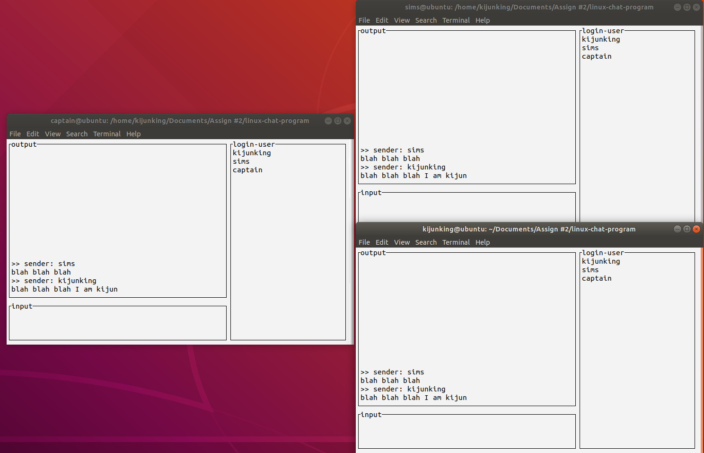

# Linux chat program

This is the simple linux chatting program. This doesn't support the TCP/IP. Therefore, if you want to this program with network condition then you use the SSH.

For instance, you make two user `test1`, `test2` which can be achieved by `sudo useradd test1 -m` and `sudo useradd test2 -m`. In this condition, you can follow the below instruction.

1. admin makes the execution file with `make`. it will make the `chat` file which can be run by other user(`test1`, `test2`).
2. `test1` user can access the system with SSH like `ssh test1@localhost` and run the `chat` execution file. `test2` user  also does same.
3. `test1` and `test2` user can talk to each other.

This program runs like below.

**You can exit with the type `<F1>` or  `./bye<CR>` in the input box.**

>  NOTICE! this program doesn't support the interrupt signal(like Ctrl+C). It may produce the system garbage.  So, you have to avoid to use the interrupt signal. Unfortunately, you use the interrupt signal. Then you follow the instruction.
>
> 1. type the `ipcs`
> 2. find the `666` mod shared memory and remember that `shmid`.
> 3. type the `ipcrm -m <shmid>`